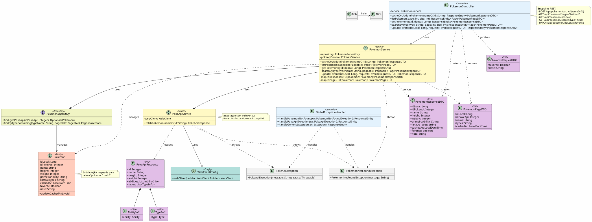
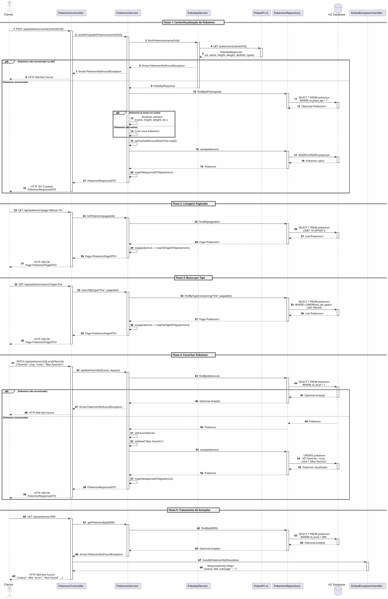
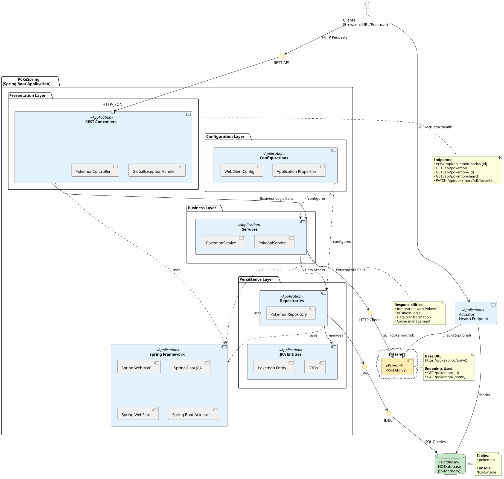

# 🎮 PokeSpring

API REST desenvolvida em Spring Boot que consome a [PokeAPI v2](https://pokeapi.co/) e cacheia dados de Pokémon em um banco de dados H2 local.

## 📋 Índice

- [Sobre o Projeto](#sobre-o-projeto)
- [Tecnologias Utilizadas](#tecnologias-utilizadas)
- [Arquitetura](#arquitetura)
- [Pré-requisitos](#pré-requisitos)
- [Instalação e Execução](#instalação-e-execução)
- [Endpoints da API](#endpoints-da-api)
- [Exemplos de Uso](#exemplos-de-uso)
- [Estrutura do Projeto](#estrutura-do-projeto)
- [Diagramas UML](#diagramas-uml)
- [Testes](#testes)
- [Contribuindo](#contribuindo)

## 🎯 Sobre o Projeto

Esta aplicação implementa um microserviço que:

1. **Busca Pokémon na PokeAPI v2** (por nome ou ID)
2. **Persiste dados essenciais no H2** (cache local)
3. **Expõe endpoints REST** para consulta e gerenciamento desses dados
4. **Segue a arquitetura MVC**: controller (REST), service (regra/integração), repository (JPA), model (entidades/DTOs)

### Principais Funcionalidades

- ✅ Cache de dados de Pokémon da PokeAPI
- ✅ Listagem paginada de Pokémon em cache
- ✅ Busca por tipo (case-insensitive)
- ✅ Marcar Pokémon como favorito com notas
- ✅ Detalhamento completo de Pokémon
- ✅ Health check via Spring Actuator

## 🛠️ Tecnologias Utilizadas

- **Java 21**
- **Spring Boot 3.5.6**
  - Spring Web (REST API)
  - Spring Data JPA (persistência)
  - Spring WebFlux (WebClient para integração)
  - Spring Boot Actuator (health check)
- **H2 Database** (banco em memória com console habilitado)
- **Maven** (gerenciamento de dependências)
- **Lombok** (redução de boilerplate)
- **PlantUML** (diagramas UML)

## 🏗️ Arquitetura

O projeto segue o padrão **MVC (Model-View-Controller)** com separação de responsabilidades:

```
┌─────────────┐
│   Client    │
└──────┬──────┘
       │ HTTP
       ▼
┌─────────────┐
│ Controller  │ ◄── REST Endpoints
└──────┬──────┘
       │
       ▼
┌─────────────┐
│   Service   │ ◄── Business Logic & Integration
└──────┬──────┘
       │
       ├──────────────┐
       ▼              ▼
┌─────────────┐  ┌──────────────┐
│ Repository  │  │ PokeAPI      │
└──────┬──────┘  │ Service      │
       │         └──────┬───────┘
       ▼                ▼
┌─────────────┐  ┌──────────────┐
│ H2 Database │  │ PokeAPI v2   │
└─────────────┘  └──────────────┘
```

## 📦 Ambiente Inicial 

- **Ubuntu 24.04 LTS** (ou outra distribuição Linux/WSL2)
- **SDKMAN!** (para gerenciar versões do Java e Maven)
- **Java 21+**
- **Maven 3.6+**

### Instalando SDKMAN! e dependências

```bash
# Instalar SDKMAN!
curl -s "https://get.sdkman.io" | bash
source "$HOME/.sdkman/bin/sdkman-init.sh"

# Verificar instalação
sdk version

# Instalar Java 17
sdk install java 21.0.9-tem

# Instalar Maven
sdk install maven 3.5.6

# Verificar instalações
java -version
mvn -version
```

## 🚀 Instalação e Execução

### 1. Clonar o repositório

```bash
git clone https://github.com/antonion313/pokespring.git
cd pokemon-cache-api
```

### 2. Compilar o projeto

```bash
mvn clean install
```

### 3. Executar a aplicação

```bash
# Opção 1: Via Maven
mvn spring-boot:run

# Opção 2: Via JAR compilado
java -jar target/pokespring-1.0.0.jar

# Opção 3: Via Gradle (se preferir)
./gradlew bootRun
```

A aplicação estará disponível em: **http://localhost:8080**

### 4. Acessar o Console H2

Acesse: **http://localhost:8080/h2-console**

- **JDBC URL**: `jdbc:h2:mem:pokemondb`
- **User Name**: `sa`
- **Password**: (deixe vazio)

## 📡 Endpoints da API

### Base URL
```
http://localhost:8080/api
```

### 1. Cache/Atualização de Pokémon

Consulta a PokeAPI e salva/atualiza no H2.

```http
POST /api/pokemon/cache/{nameOrId}
```

**Parâmetros:**
- `nameOrId` (path): Nome ou ID do Pokémon (ex: "pikachu" ou "25")

**Resposta (201 Created):**
```json
{
  "idLocal": 1,
  "idPokeApi": 25,
  "name": "pikachu",
  "height": 4,
  "weight": 60,
  "primeiraAbility": "static",
  "listaDeTypes": "electric",
  "cachedAt": "2025-10-22T14:30:00",
  "favorite": false,
  "note": null
}
```

**Erros:**
- `404 Not Found`: Pokémon não encontrado na PokeAPI
- `502 Bad Gateway`: Erro ao comunicar com PokeAPI

### 2. Listagem Paginada

Lista todos os Pokémon em cache com paginação.

```http
GET /api/pokemon?page=0&size=10
```

**Parâmetros:**
- `page` (query, opcional): Número da página (default: 0)
- `size` (query, opcional): Tamanho da página (default: 10)

**Resposta (200 OK):**
```json
{
  "content": [
    {
      "idLocal": 1,
      "idPokeApi": 25,
      "name": "pikachu",
      "types": "electric",
      "cachedAt": "2025-10-22T14:30:00"
    }
  ],
  "pageable": {
    "pageNumber": 0,
    "pageSize": 10
  },
  "totalElements": 1,
  "totalPages": 1
}
```

### 3. Detalhes de Pokémon

Retorna o registro completo do H2.

```http
GET /api/pokemon/{idLocal}
```

**Parâmetros:**
- `idLocal` (path): ID local do Pokémon no banco

**Resposta (200 OK):**
```json
{
  "idLocal": 1,
  "idPokeApi": 25,
  "name": "pikachu",
  "height": 4,
  "weight": 60,
  "primeiraAbility": "static",
  "listaDeTypes": "electric",
  "cachedAt": "2025-10-22T14:30:00",
  "favorite": true,
  "note": "Meu favorito!"
}
```

**Erros:**
- `404 Not Found`: idLocal não existe

### 4. Busca por Tipo

Filtra Pokémon cujos tipos contenham o termo buscado (case-insensitive).

```http
GET /api/pokemon/search?type=fire&page=0&size=10
```

**Parâmetros:**
- `type` (query, obrigatório): Nome do tipo a buscar
- `page` (query, opcional): Número da página (default: 0)
- `size` (query, opcional): Tamanho da página (default: 10)

**Resposta (200 OK):**
```json
{
  "content": [
    {
      "idLocal": 2,
      "idPokeApi": 4,
      "name": "charmander",
      "types": "fire",
      "cachedAt": "2025-10-22T15:00:00"
    }
  ],
  "totalElements": 1
}
```

### 5. Favoritar/Adicionar Nota

Atualiza campos `favorite` e `note` de um Pokémon.

```http
PATCH /api/pokemon/{idLocal}/favorite
Content-Type: application/json

{
  "favorite": true,
  "note": "Meu Pokémon favorito!"
}
```

**Body (JSON):**
```json
{
  "favorite": true,
  "note": "opcional"
}
```

**Resposta (200 OK):**
```json
{
  "idLocal": 1,
  "idPokeApi": 25,
  "name": "pikachu",
  "favorite": true,
  "note": "Meu Pokémon favorito!"
}
```

**Erros:**
- `404 Not Found`: idLocal não existe

### 6. Health Check

Verifica o status da aplicação.

```http
GET /actuator/health
```

**Resposta (200 OK):**
```json
{
  "status": "UP"
}
```

## 💡 Exemplos de Uso

### Usando cURL

```bash
# 1. Cache Pikachu
curl -X POST http://localhost:8080/api/pokemon/cache/pikachu

# 2. Listar Pokémon
curl http://localhost:8080/api/pokemon?page=0&size=5

# 3. Buscar por tipo
curl http://localhost:8080/api/pokemon/search?type=electric

# 4. Detalhe por ID local
curl http://localhost:8080/api/pokemon/1

# 5. Marcar como favorito
curl -X PATCH http://localhost:8080/api/pokemon/1/favorite \
  -H "Content-Type: application/json" \
  -d '{"favorite": true, "note": "Meu favorito!"}'

# 6. Health check
curl http://localhost:8080/actuator/health
```

### Usando HTTPie

```bash
# Cache Charizard
http POST localhost:8080/api/pokemon/cache/charizard

# Buscar tipo "fire"
http GET localhost:8080/api/pokemon/search type==fire page==0 size==10

# Favoritar
http PATCH localhost:8080/api/pokemon/1/favorite \
  favorite:=true \
  note="Melhor Pokémon!"
```

## 📂 Estrutura do Projeto

```
pokemon-cache-api/
├── src/main/java/com/ada/pokemoncache/
│   ├── PokemonCacheApplication.java          # Classe principal
│   ├── controller/
│   │   ├── PokemonController.java            # Endpoints REST
│   │   └── advice/
│   │       └── GlobalExceptionHandler.java   # Tratamento de erros
│   ├── service/
│   │   ├── PokemonService.java               # Lógica de negócio
│   │   └── PokeApiService.java               # Integração PokeAPI
│   ├── repository/
│   │   └── PokemonRepository.java            # Acesso a dados (JPA)
│   ├── model/
│   │   ├── Pokemon.java                      # Entidade JPA
│   │   └── dto/
│   │       ├── PokemonResponseDTO.java       # DTO resposta completa
│   │       ├── PokemonPageDTO.java           # DTO listagem
│   │       ├── FavoriteRequestDTO.java       # DTO favoritar
│   │       └── pokeapi/
│   │           ├── PokeApiResponse.java      # DTO da API externa
│   │           ├── AbilityInfo.java          # Info habilidades
│   │           └── TypeInfo.java             # Info tipos
│   ├── config/
│   │   └── WebClientConfig.java              # Config WebClient
│   └── exception/
│       ├── PokemonNotFoundException.java     # Exception customizada
│       └── PokeApiException.java             # Exception API externa
├── src/main/resources/
│   ├── application.properties                # Configurações
│   └── application.yml                       # Alternativa YAML
├── docs/
│   ├── class-diagram.puml                    # Diagrama de classes
│   └── sequence-diagram.puml                 # Diagrama de sequência
├── pom.xml                                   # Dependências Maven
└── README.md                                 # Este arquivo
```

## 📊 Diagramas UML





**Principais componentes:**
- **Controller**: PokemonController, GlobalExceptionHandler
- **Service**: PokemonService, PokeApiService
- **Repository**: PokemonRepository
- **Model**: Pokemon (Entity), DTOs
- **Config**: WebClientConfig

**Fluxos documentados:**
1. Cache/Atualização de Pokémon
2. Listagem Paginada
3. Busca por Tipo
4. Favoritar Pokémon
5. Tratamento de Exceções

## 🧪 Testes

### Executar todos os testes

```bash
mvn test
```

### Cobertura de código

```bash
mvn verify
```

## 📝 Validações e Erros

### HTTP 404 - Not Found

- Pokémon não encontrado na PokeAPI
- idLocal inexistente no banco

**Exemplo de resposta:**
```json
{
  "timestamp": "2025-10-22T14:30:00",
  "status": 404,
  "error": "Not Found",
  "message": "Pokemon não encontrado na PokeAPI: abc123"
}
```

### HTTP 502 - Bad Gateway

- Erro de comunicação com PokeAPI
- Timeout ou falha na API externa

**Exemplo de resposta:**
```json
{
  "timestamp": "2025-10-22T14:30:00",
  "status": 502,
  "error": "Bad Gateway",
  "message": "Erro ao comunicar com PokeAPI"
}
```

## 🔧 Configurações Avançadas

### Alterar porta do servidor

```properties
# application.properties
server.port=8081
```

### Configurar timeout do WebClient

```java
// WebClientConfig.java
@Bean
public WebClient webClient(WebClient.Builder builder) {
    return builder
        .baseUrl("https://pokeapi.co/api/v2")
        .defaultHeader(HttpHeaders.CONTENT_TYPE, MediaType.APPLICATION_JSON_VALUE)
        .build();
}
```

### Habilitar mais endpoints do Actuator

```properties
# application.properties
management.endpoints.web.exposure.include=health,info,metrics
```

## 📚 Referências

- [PokeAPI v2 Documentation](https://pokeapi.co/docs/v2)
- [Spring Boot Documentation](https://spring.io/projects/spring-boot)
- [Spring Data JPA](https://spring.io/projects/spring-data-jpa)
- [H2 Database](https://www.h2database.com/)

## 📄 Licença

Este projeto foi desenvolvido para fins educacionais como parte do curso Ada Tech.

---

**Desenvolvido com ❤️ usando Spring Boot**

Para dúvidas ou sugestões, abra uma [issue](https://github.com/antonion313/pokespring/issues).